Ein Computer besteht aus Teilen zum Anfassen und aus Programmen. Bedient wird er über das, was du auf dem Bildschirm siehst.

## Hardware und Software

- **Hardware** ist alles, was du anfassen kannst: Bildschirm, Maus, Prozessor, Festplatte.
- **Software** sind die Programme. Ohne sie tut die Hardware nichts.

| Art der Software | Aufgabe | Beispiele |
| --- | --- | --- |
| **Systemsoftware** (Betriebssystem) | startet den Computer, verwaltet Dateien und Geräte, zeigt die Oberfläche | Windows, macOS, Linux, Android, iOS |
| **Applikation** (Anwendung, App) | erledigt eine bestimmte Aufgabe für dich | Textverarbeitung, Browser, Malprogramm, Spiel |

## Die Benutzungsoberfläche

- **Fenster:** der Rahmen, in dem ein Programm läuft. Du kannst es verschieben, verkleinern, vergrößern und schließen.
- **Symbol:** ein kleines Bild, das für ein Programm, eine Datei oder einen Ordner steht. Ein Doppelklick öffnet es.
- **Schaltfläche:** ein Knopf zum Anklicken, zum Beispiel „Speichern“ oder „OK“.
- **Menü:** eine Liste mit Befehlen, die aufklappt, wenn du darauf klickst.



## Starten und Beenden

1. **Anmelden:** In der Schule gibst du Benutzername und Passwort ein. Dein Passwort gehört nur dir.
2. **Programm starten:** über das Symbol oder das Startmenü.
3. **Programm beenden:** erst speichern, dann das Fenster schließen.
4. **Abmelden:** immer, bevor du gehst. Sonst arbeitet die nächste Person in deinem Namen weiter.

> **Merke:** Reagiert ein Programm nicht mehr, warte kurz und schließe dann nur dieses Programm. Den Stecker ziehst du nie, dabei können Daten verloren gehen.

```zuordnen
id: hwsw-sort
titel: Übung: Hardware oder Software?
frage: Was ist das?
kategorien: Hardware | Systemsoftware | Applikation

Grafikkarte: Hardware
Maus: Hardware
Arbeitsspeicher: Hardware
Bildschirm: Hardware
Windows: Systemsoftware
Android: Systemsoftware
Linux: Systemsoftware
Textverarbeitung: Applikation
Browser: Applikation
Malprogramm: Applikation
Taschenrechner-App: Applikation
```

```quiz
id: ober-quiz
titel: Übung: Oberfläche und Programme

? Wie heißt ein Knopf auf dem Bildschirm, den man anklickt?
+ Schaltfläche
- Fenster
- Verzeichnis
- Hardware
> Auf Englisch: Button.

? Was ist ein Fenster?
+ Der Rahmen, in dem ein Programm läuft
- Ein Speichermedium
- Ein Eingabegerät
> Mehrere Fenster können gleichzeitig offen sein.

? Welche Software braucht jeder Computer, damit überhaupt etwas läuft?
+ Ein Betriebssystem
- Eine Textverarbeitung
- Ein Spiel
> Das Betriebssystem ist die Systemsoftware.

? Was ist ein Menü?
+ Eine aufklappende Liste mit Befehlen
- Ein kleines Bild für eine Datei
- Ein Teil der Hardware
> Im Menü „Datei“ findest du zum Beispiel Speichern und Öffnen.

? Ein Programm reagiert nicht mehr. Was tust du?
+ Kurz warten, dann nur dieses Programm schließen oder Hilfe holen
- Den Stecker ziehen
- Schnell auf alles klicken
> Beim Steckerziehen können Daten verloren gehen.

? Was tust du, bevor du den Schulcomputer verlässt?
+ Abmelden
- Bildschirm ausschalten reicht
- Das Passwort an die Tafel schreiben
> Sonst kann die nächste Person an deine Dateien.
```

## Praxis

- [ ] Finde heraus, welches Betriebssystem auf eurem Computer und auf einem Handy in der Familie läuft. {#hardsoft-t0-0}
- [ ] Öffne zwei Programme gleichzeitig. Ordne die Fenster nebeneinander an, verkleinere eines und hole es wieder hervor. {#hardsoft-t0-1}
- [ ] Suche in einem Programm je ein Beispiel für Symbol, Schaltfläche und Menü und beschrifte sie in einem Bildschirmfoto oder einer Skizze. {#hardsoft-t0-2}
- [ ] Schreibe die Schritte vom Einschalten bis zum Abmelden so auf, dass ein Grundschulkind sie befolgen könnte. {#hardsoft-t0-3}

## Weiterlesen und Ausprobieren

- Kinderlexikon: [Software](https://klexikon.zum.de/wiki/Software) – Programme und Apps, einfach erklärt.
- Wikipedia: [Hardware](https://de.wikipedia.org/wiki/Hardware) – Die Bauteile eines Computers im Überblick.
- Wikipedia: [Betriebssystem](https://de.wikipedia.org/wiki/Betriebssystem) – Was Windows, Linux und Android gemeinsam haben.
- Wikipedia: [Grafische Benutzeroberfläche](https://de.wikipedia.org/wiki/Grafische_Benutzeroberfläche) – Fenster, Symbole und Menüs und wie sie entstanden sind.
