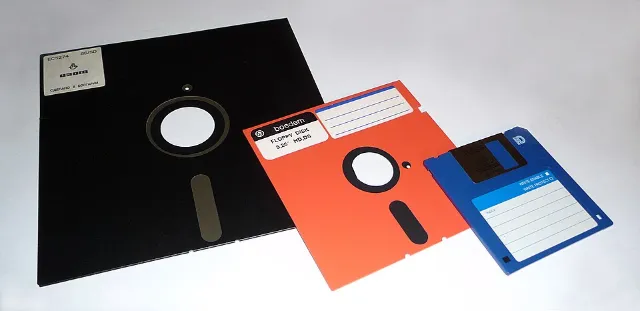
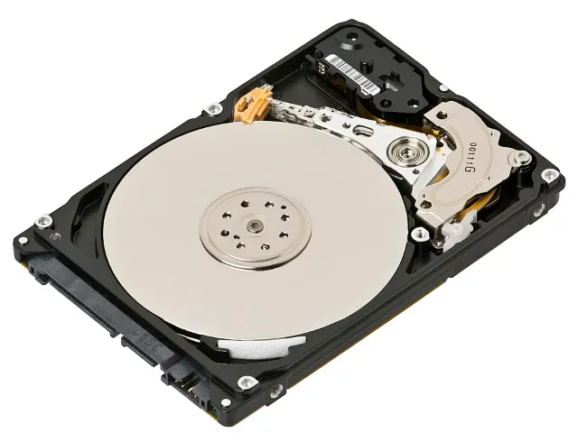
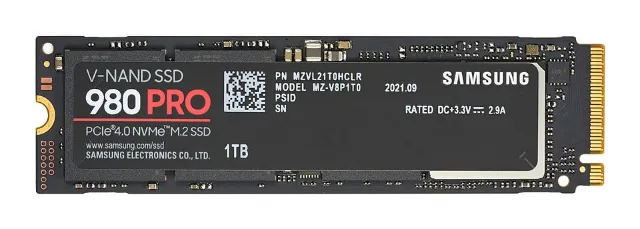
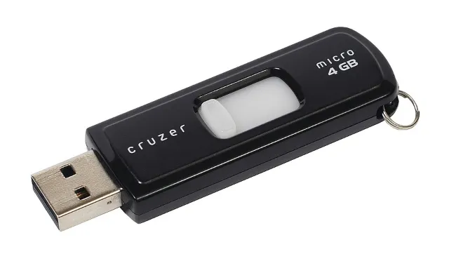
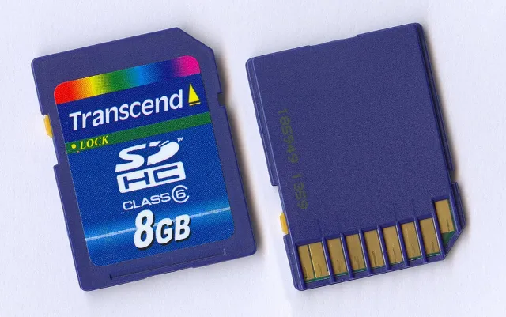

Alles, was du am Computer erarbeitest, landet in Dateien. Wer sie wiederfinden will, braucht gute Namen und eine Ordnung.

## Datei und Dateiart

Eine **Datei** ist ein gespeichertes Stück Daten mit einem Namen. Hinter dem Punkt steht die Endung, sie verrät die Dateiart:

| Dateiart | Inhalt | Typische Endungen |
| --- | --- | --- |
| Textdatei | geschriebener Text | `.txt .odt .docx` |
| Grafikdatei | Bilder und Zeichnungen | `.jpg .png .gif` |
| Programmdatei | ein Programm, das der Computer ausführt | `.exe` |

## Ordner und Verzeichnisstruktur

Ein **Ordner** (auch Verzeichnis) ist ein Behälter für Dateien und weitere Ordner. So entsteht eine Verzeichnisstruktur, die wie ein Baum aussieht. Der Weg zu einer Datei heißt Pfad: Dokumente › Schule › Klasse6 › TC.

```
Dokumente
└─ Schule
   └─ Klasse6
      ├─ Deutsch
      ├─ Mathe
      └─ TC
         ├─ TC_Steckbrief_Fahrrad.odt
         └─ Fahrrad_Foto.jpg
```

> **Merke:** Ein guter Dateiname sagt, was drin ist: `TC_Steckbrief_Fahrrad` findest du wieder, `neu2` nicht.

## Speichern und Öffnen

- **Speichern** überschreibt die vorhandene Datei mit dem neuen Stand.
- **Speichern unter** legt eine neue Datei an. Du wählst Ordner und Namen.
- **Öffnen** holt eine gespeicherte Datei zurück ins Programm.

## Wo deine Dateien liegen

Dateien liegen auf einem Speichermedium. Früher waren das vor allem Disketten, heute sind es Festplatten, SSDs, USB-Sticks und Speicherkarten.








## Daten austauschen

Dateien wandern auf mehreren Wegen von einem Gerät zum anderen: auf einem USB-Stick, über einen gemeinsamen Ordner im Schulnetzwerk, über die Lernplattform oder als Anhang einer E-Mail.

```zuordnen
id: datei-sort
titel: Übung: Dateiarten erkennen
frage: Was für eine Datei ist das?
kategorien: Textdatei | Grafikdatei | Programmdatei

aufsatz.docx: Textdatei
notizen.txt: Textdatei
bericht.odt: Textdatei
urlaub.jpg: Grafikdatei
logo.png: Grafikdatei
skizze.gif: Grafikdatei
setup.exe: Programmdatei
spiel.exe: Programmdatei
```

```reihenfolge
id: speichern-order
titel: Übung: Ein neues Dokument speichern
einleitung: Bringe die Schritte in die richtige Reihenfolge.

1. Textverarbeitung starten
2. Text schreiben
3. „Speichern unter“ wählen
4. Zielordner auswählen und Dateinamen eintippen
5. Auf „Speichern“ klicken
6. Programm beenden
```

```quiz
id: datei-quiz
titel: Übung: Dateien und Ordner

? Welcher Dateiname ist am besten gewählt?
+ TC_Steckbrief_Fahrrad
- Dokument1
- neu_neu_final2
- asdf
> Der Name sagt Fach und Inhalt. So findest du die Datei in einem Jahr noch.

? Was ist ein Ordner?
+ Ein Behälter für Dateien und weitere Ordner
- Ein Programm zum Schreiben
- Ein anderes Wort für Datei
- Ein Teil des Bildschirms
> Ordner heißen auch Verzeichnisse.

? Eine Datei liegt unter Dokumente › Schule › Klasse6 › TC. In welchem Ordner liegt sie direkt?
+ TC
- Dokumente
- Schule
- Klasse6
> Der letzte Ordner im Pfad enthält die Datei.

? Wann nimmst du „Speichern unter“ statt „Speichern“?
+ Wenn die Datei einen neuen Namen oder einen anderen Ort bekommen soll
- Immer, wenn es schnell gehen muss
- Wenn du die Datei löschen willst
> „Speichern“ überschreibt die vorhandene Datei. „Speichern unter“ legt eine neue an.

? Woran erkennst du die Dateiart?
+ An der Endung hinter dem Punkt
- An der Länge des Namens
- Am ersten Buchstaben
> Zum Beispiel .odt für Text und .jpg für ein Bild.

? Im Ordner Klasse6 liegen die Ordner Deutsch, Mathe und TC. In TC liegen 2 Dateien, in Deutsch 3, in Mathe keine. Wie viele Dateien liegen insgesamt unterhalb von Klasse6?
= 5
> 2 + 3 + 0 = 5. Dateien in Unterordnern zählen mit.

? Wie kommt eine Datei vom Schulcomputer auf deinen Computer zu Hause?
+ Per USB-Stick, Lernplattform oder E-Mail-Anhang
- Gar nicht
- Sie ist automatisch auf jedem Computer
> Das nennt man Datenaustausch.
```

## Praxis

- [ ] Lege auf dem Computer die Ordner aus dem Baum oben an: Schule, darin Klasse6, darin Deutsch, Mathe und TC. {#dateien-t0-0}
- [ ] Schreibe einen Satz in der Textverarbeitung, speichere die Datei im Ordner TC, schließe das Programm und öffne die Datei wieder. {#dateien-t0-1}
- [ ] Benenne die Datei um, kopiere sie in den Ordner Deutsch und lösche die Kopie wieder. {#dateien-t0-2}
- [ ] Kopiere die Datei auf einen USB-Stick und öffne sie von dort. Wirf den Stick aus, bevor du ihn abziehst. {#dateien-t0-3}

## Weiterlesen und Ausprobieren

- Wikipedia: [Datei](https://de.wikipedia.org/wiki/Datei) – Was eine Datei ist und wie sie gespeichert wird.
- Wikipedia: [Verzeichnisstruktur](https://de.wikipedia.org/wiki/Verzeichnisstruktur) – Ordner, Unterordner und der Verzeichnisbaum.
- Wikipedia: [Dateinamenserweiterung](https://de.wikipedia.org/wiki/Dateinamenserweiterung) – Was Endungen wie .jpg oder .odt bedeuten.
