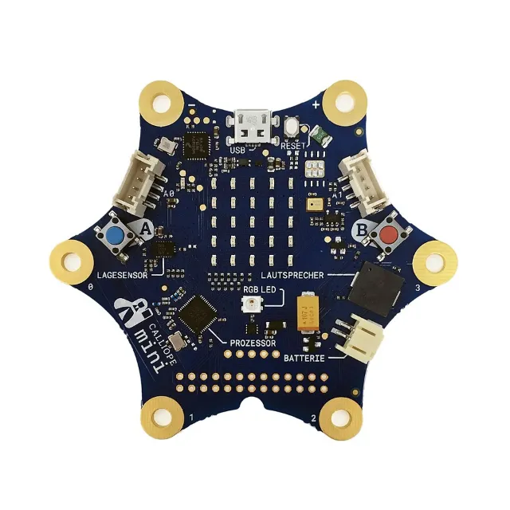

In Heizung, Waschmaschine und Schrittzähler steckt ein winziger Computer auf einer einzigen Platine, ein Mikrocontroller. Auch er arbeitet nach dem EVA-Prinzip.

- **Sensoren** sind die Eingabe. Sie messen etwas: Taster, Temperatur, Helligkeit, Lage, Lautstärke.
- Das **Programm** ist die Verarbeitung. Es entscheidet nach Regeln wie „Wenn es kälter als 20 °C ist, dann schalte die Heizung ein“.
- **Aktoren** sind die Ausgabe. Sie tun etwas: LED, Lautsprecher, Motor, Ventil.

| Gerät | Eingabe (Sensor) | Verarbeitung | Ausgabe (Aktor) |
| --- | --- | --- | --- |
| Heizungsregelung | Temperaturfühler | vergleicht mit der eingestellten Temperatur | Heizungsventil |
| Schrittzähler | Bewegungssensor | zählt die Erschütterungen | Anzeige |
| Dämmerungslicht | Lichtsensor | prüft, ob es dunkel ist | Lampe |

> **Steuern oder regeln?** Beim Steuern läuft ein fester Ablauf ab, etwa eine Ampel nach Zeit. Beim Regeln misst ein Sensor ständig nach und das Programm passt an, etwa die Heizung an die Raumtemperatur.

Schulen nutzen als Einplatinenrechner oft den Calliope mini oder den micro:bit. Beide haben Taster, eine Anzeige aus 25 Leuchtdioden und Sensoren für Lage, Licht und Temperatur.


 von hinten mit seinen Chips.")

```zuordnen
id: sens-sort
titel: Übung: Sensor oder Aktor?
frage: Was ist das?
kategorien: Sensor (Eingabe) | Aktor (Ausgabe)

Temperaturfühler: Sensor (Eingabe)
Taster: Sensor (Eingabe)
Lichtsensor: Sensor (Eingabe)
Lagesensor: Sensor (Eingabe)
Mikrofon: Sensor (Eingabe)
Leuchtdiode (LED): Aktor (Ausgabe)
Lautsprecher: Aktor (Ausgabe)
Motor: Aktor (Ausgabe)
Heizungsventil: Aktor (Ausgabe)
Anzeige: Aktor (Ausgabe)
```

```quiz
id: mini-quiz
titel: Übung: Mikrocontroller

? Ein Schrittzähler zählt deine Schritte. Welcher Sensor liefert die Eingabe?
+ Lage- und Bewegungssensor
- Temperatursensor
- Lautsprecher
> Er spürt die Erschütterung bei jedem Schritt.

? Die Heizung misst die Raumtemperatur und öffnet oder schließt das Ventil. Ist das Steuern oder Regeln?
+ Regeln
- Steuern
> Beim Regeln wird ständig gemessen und angepasst.

? Eine Ampel schaltet nach festen Zeiten um. Steuern oder Regeln?
+ Steuern
- Regeln
> Es läuft ein fester Ablauf, ohne dass nachgemessen wird.

? Was ist bei einem Mikrocontroller die Verarbeitung?
+ Das Programm, das nach Regeln entscheidet
- Der Taster
- Die LED
> Sensoren geben ein, das Programm verarbeitet, Aktoren geben aus.
```

## Praxis

- [ ] Suche in der Wohnung drei Geräte, in denen ein Mikrocontroller steckt, und nenne je einen Sensor und einen Aktor. {#mini-t0-0}
- [ ] Ergänze die Tabelle oben um zwei eigene Geräte, zum Beispiel Kühlschrank und automatische Tür. {#mini-t0-1}
- [ ] Entscheide für fünf Geräte aus eurem Haushalt: Wird hier gesteuert oder geregelt? {#mini-t0-2}

## Weiterlesen und Ausprobieren

- Kinderlexikon: [Roboter](https://klexikon.zum.de/wiki/Roboter) – Maschinen, die mit Sensoren und Programmen arbeiten.
- Hersteller: [Calliope mini](https://calliope.cc) – Der Minicomputer für die Schule, mit Projektideen.
- Hersteller: [micro:bit](https://microbit.org/de/) – Der zweite verbreitete Minicomputer, mit Projektideen.
- Wikipedia: [Mikrocontroller](https://de.wikipedia.org/wiki/Mikrocontroller) – Wo überall kleine Computer stecken.
- Wikipedia: [Sensor](https://de.wikipedia.org/wiki/Sensor) – Arten von Sensoren und was sie messen.
- Wikipedia: [Aktor](https://de.wikipedia.org/wiki/Aktor) – Bauteile, die ein Signal in Bewegung, Licht oder Ton umsetzen.
